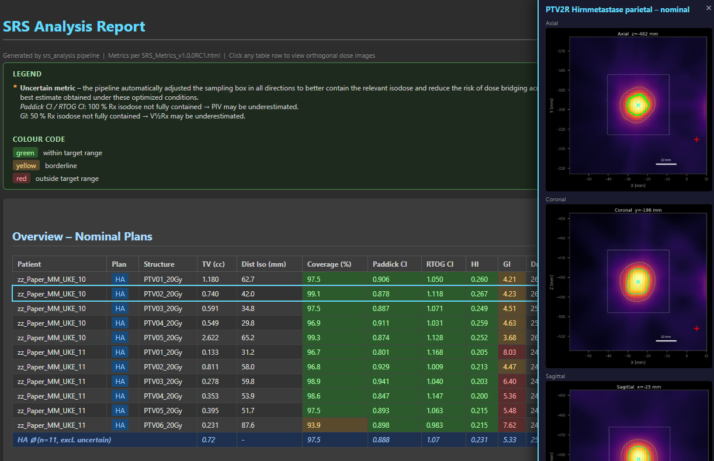

# SRS Analysis Pipeline

Automated evaluation of stereotactic radiosurgery (SRS) DICOM datasets for multiple patients and treatment plans.


## Screenshot



Interactive HTML report with color-coded metrics, patient/plan sections, and clickable rows for orthogonal slice views.
## Project Structure

```
srs_analysis/
├── config.py            – All configuration constants (debug mode, paths, thresholds)
├── dicom_io.py          – Folder scanning, DICOM loading (RS / RD / RP)
├── structure_mapping.py – PTV candidate detection, prescription estimation, naming
├── excel_io.py          – Build / update / merge PTV mapping Excel table
├── metrics.py           – SRS metric calculations (Paddick CI, RTOG CI, GI, HI, …)
├── shift_scenarios.py   – 6D shift scenario definitions and dose transformation
├── html_report.py       – HTML report generation
├── main.py              – Pipeline orchestrator (Phases A–E)
└── README.md            – This file

output/                  – Created automatically on first run
├── ptv_mapping.xlsx     – PTV mapping table (editable)
├── metrics.csv          – Calculated metrics
├── shift_scenarios.xlsx – Shift scenario definitions (editable)
├── report.html          – HTML report with interactive views
├── pipeline.log         – Full log
├── views/               – Orthogonal slice views (PNG)
│   └── <patient>/<plan>/<structure>/
│       ├── axial_nominal.png
│       ├── axial_1-0-0--0-0-0.png
│       └── ...
└── dicom_export/        – Modified RD+RP files (if ENABLE_DICOM_EXPORT=True)
    └── <patient>_<plan>_<scenario>/
        ├── RD.<original>.dcm
        └── RP.<original>.dcm
```

## Prerequisites

**Python 3.8+** required.

Install dependencies:

```bash
pip install pydicom numpy pandas openpyxl matplotlib
```

## Quick Start

### 1. Prepare Your DICOM Data

Organize your DICOM files in the following structure:

```
data/
├── Patient_001/
│   ├── RS.*.dcm          # Structure Set
│   ├── RD.*.Plan1.dcm    # Dose file for Plan1
│   ├── RP.*.Plan1.dcm    # Plan file for Plan1
│   ├── RD.*.Plan2.dcm    # (optional) Dose file for Plan2
│   └── RP.*.Plan2.dcm    # (optional) Plan file for Plan2
├── Patient_002/
│   └── ...
```

**Important**: 
- Each patient folder must contain **one RS file** and **at least one RD+RP pair**.
- Plan type is detected from the **last dot-separated token** before `.dcm` in the filename.
  - Example: `RD.something.MyPlan.dcm` → plan type = `MyPlan`
  - Example: `RD.data.HA.dcm` → plan type = `HA`

### 2. Configure the Pipeline

Open `config.py` and adjust:

```python
# Point to your DICOM data folder
DATA_ROOT = r"C:\path\to\your\data"  # or use relative path: "../data"

# For initial testing, use debug mode
DEBUG_MODE = True
DEBUG_MAX_PATIENTS = 2

# IMPORTANT: Adjust plan type detection to match YOUR filenames
# If your files are named like "RD.*.MyPlan.dcm", set:
DEBUG_PLAN_TYPES = ["MyPlan"]  # or ["Plan1", "Plan2"] for multiple

# If you don't have specific plan type suffixes, comment out this line:
# DEBUG_PLAN_TYPES = None  # processes all plans found
```

### 3. Run the Pipeline

```bash
cd srs_analysis
python main.py
```

### 4. Review and Refine

Open `output/ptv_mapping.xlsx` and review/edit:
- `ExcludeFromAnalysis` – set to `True`/`1`/`X` to exclude a structure
- `ExcludeReason` – optional text
- `Prescription_Gy_reference` – override auto-detected prescription
- `NewStructureName` – override auto-generated name

Re-run `python main.py` to recalculate with your edits preserved.

## Configuration Reference (`config.py`)

| Variable | Default | Description |
|---|---|---|
| `DEBUG_MODE` | `True` | Restricts to 2 patients for testing |
| `DEBUG_MAX_PATIENTS` | `2` | Patients processed in debug mode |
| `DEBUG_PLAN_TYPES` | `["Plan1"]` | Plan types to process (must match filename suffix before `.dcm`). Set to `None` to process all plans. |
| `DATA_ROOT` | `"../data"` | Path to folder containing patient subfolders with DICOM files |
| `PTV_DETECTION_MODE` | `"name_startswith_ptv"` | How PTV candidates are identified |
| `ENABLE_SHIFT_SCENARIOS` | `False` | Enable 6D shift robustness analysis |
| `ENABLE_DICOM_EXPORT` | `True` | Export shifted RD+RP with new UIDs |
| `ENABLE_VIEWS` | `True` | Generate orthogonal slice views (PNG) |
| `GRID_STEP_SIZES` | `[1.0, 0.5, 0.25]` | Grid refinement steps (mm) |
| `BOUNDARY_FIXED_MARGIN_MM` | `15.0` | Expansion margin for PIV/GI calculation |
| `BOUNDARY_CLOSURE_DELTA_MM` | `2.0` | Additional margin for isodose closure check |
| `PIV_CLOSURE_TOL` | `0.02` | PIV stability tolerance (2%) for uncertainty flag |
| `SHOW_COMPUTATION_BOUNDARY` | `True` | Show +15mm bbox in slice views |
| `V12GY_THRESHOLD` | `12.0` | Gy threshold for V12Gy metric |

## Metrics Implemented

Standard SRS quality metrics:

| Metric | Formula / Definition |
|---|---|
| **TV** | Target volume (cc) – voxels inside structure contours |
| **Coverage** | TV_at_Rx / TV (fraction receiving ≥ Rx dose) |
| **Paddick CI** | TV_at_Rx² / (TV × PIV) |
| **RTOG CI** | PIV / TV |
| **HI** | (D2 – D98) / D50 |
| **GI** | V_half_Rx / PIV |
| **Dmax** | Maximum dose inside structure (Gy) |
| **PIV** | Prescription Isodose Volume – vol ≥ Rx (cc) |
| **V12Gy** | Volume receiving ≥ 12 Gy (cc) |
| **D2 / D50 / D98** | Dose at 2% / 50% / 98% of TV (Gy) |

## PTV Naming Convention

Active PTVs are numbered per plan in a **reproducible order**:
1. **Alphabetical** by original structure name (primary)
2. Descending `Prescription_Gy_reference` (higher dose first)
3. Ascending volume (smaller lesion first)

Result: `PTV01_20Gy`, `PTV02_18Gy`, … (alphabetically sorted first)

## 6D Shift Scenarios

- Edit `output/shift_scenarios.xlsx` (created automatically).
- Set `ENABLE_SHIFT_SCENARIOS = True` in `config.py`.
- The pipeline computes metrics for each scenario and labels them as compact codes (e.g., `1/0/0//0/0/0.5`).
- **Full rotation support**: Rotations are applied via inverse transformation at each dose lookup point.
  - Metric calculation: `_interpolate_dose()` calls `ShiftedDose.transform_point()` for per-point inverse transform.
  - DICOM export: Vectorized numpy resampling of the entire dose grid (no scipy dependency).
- Exported DICOM files have new UIDs and plan labels (e.g., `Plan.1`, `Plan.2`).

## Uncertainty Flagging (CI/GI)

The pipeline uses a **PIV-stability closure check** to flag uncertain CI/GI values:
- Compute PIV and V_half_Rx at **+15mm** and **+17mm** margins around the structure bbox.
- If PIV or V_half_Rx grows by >2% when the margin increases, the isodose is **not fully enclosed** → flag with `*`.
- This replaces the old boundary-max-dose approach and is more robust for complex geometries.

## Slice Views

- Orthogonal views (axial/coronal/sagittal) saved as PNG in `output/views/<patient>/<plan>/<structure>/`.
- Filenames: `axial_nominal.png`, `axial_1-0-0--0-0-0.png`, etc. (flattened structure, no nested scenario folders).
- **Shift scenario views** show nominal 100%/50% isodoses as **gray dashed overlays** for direct comparison.
- White dashed rectangle indicates the +15mm computation bounding box (configurable via `SHOW_COMPUTATION_BOUNDARY`).

## Known Limitations / Notes

1. **Adjacent PTVs** – Each PTV is computed independently with its own +15mm margin.
   Overlapping margins are intentional and do not affect results.

2. **Prescription estimation** – Inferred from D98% rounded to nearest Gy.
   Verify against clinical prescription in `ptv_mapping.xlsx` → `Prescription_Gy_reference`.

3. **V12Gy** – Computed over the expanded bounding box, not whole-brain.
   Adjust `V12GY_THRESHOLD` in `config.py` if needed.

4. **Validation** – Metrics have been validated against reference implementations and clinical data.

## Acknowledgments

This pipeline was inspired by the [SRShelper](https://github.com/Varian-MedicalAffairsAppliedSolutions/SRShelper) project.

**For quick checks without Python installation**, consider using SRShelper directly — it's a standalone HTML-based tool that runs entirely in your browser with no dependencies required.
